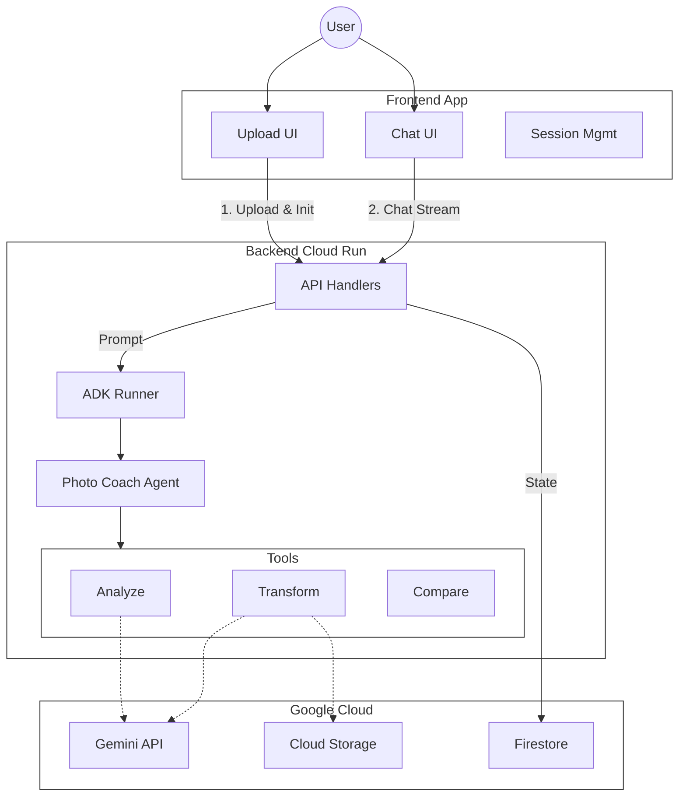

# System Architecture (Zenn Compatible)

```mermaid
graph TD
    %% Canvas
    User((User))

    subgraph Client [Frontend App]
        UI_Upload[Upload UI]
        UI_Chat[Chat UI]
        Session[Session Mgmt]
    end

    subgraph Server [Backend Cloud Run]
        API[API Handlers]
        Runner[ADK Runner]
        Agent[Photo Coach Agent]

        subgraph Toolset [Tools]
            Tool_Analyze[Analyze]
            Tool_Transform[Transform]
            Tool_Compare[Compare]
        end
    end

    subgraph Cloud [Google Cloud]
        Gemini[Gemini API]
        GCS[Cloud Storage]
        DB[Firestore]
    end

    %% Flows
    User --> UI_Upload
    User --> UI_Chat

    UI_Upload -- 1. Upload & Init --> API
    UI_Chat -- 2. Chat Stream --> API

    API -- State --> DB
    API -- Prompt --> Runner

    Runner --> Agent
    Agent --> Toolset

    %% Tool interactions
    Tool_Analyze -.-> Gemini
    Tool_Transform -.-> Gemini
    Tool_Transform -.-> GCS

    %% Styles
    classDef plain fill:#fff,stroke:#333,stroke-width:1px;
    class Client,Server,Cloud,Toolset plain;
```
