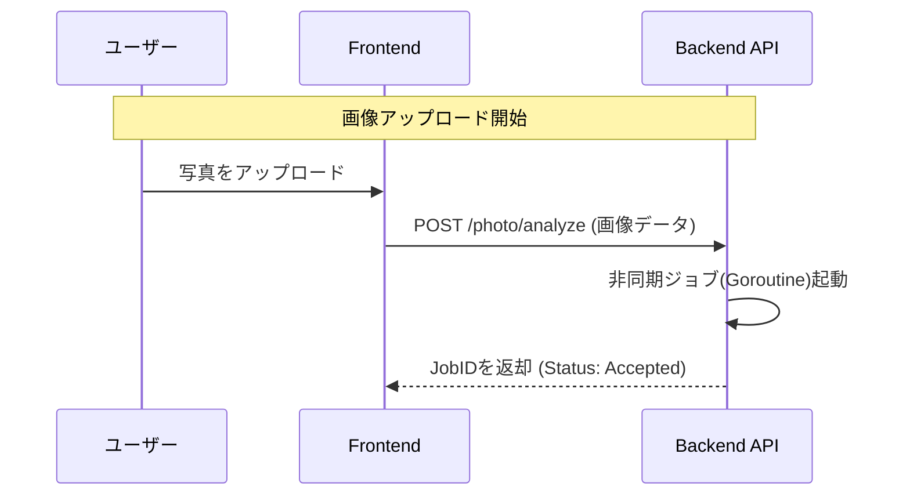
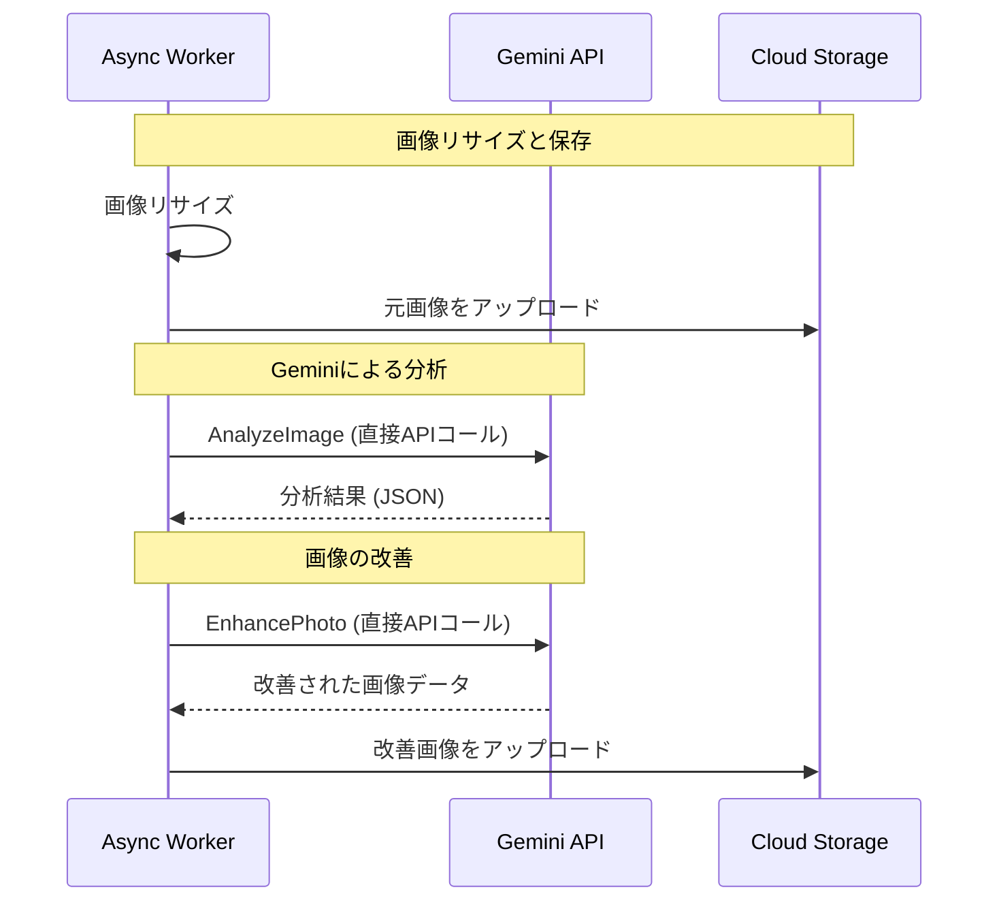
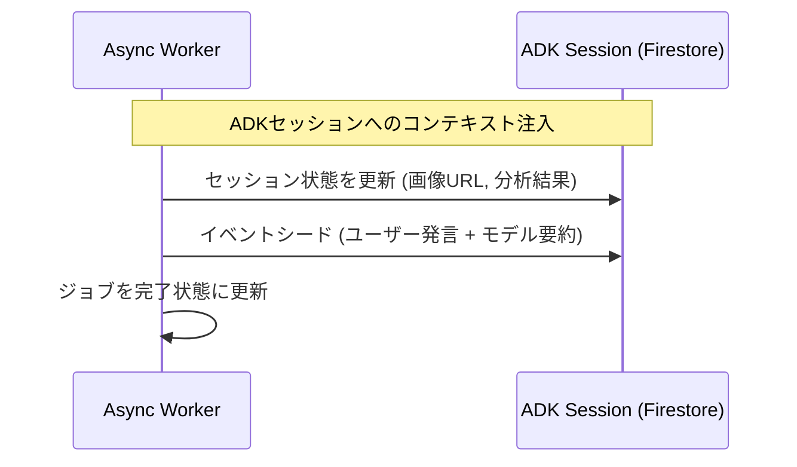
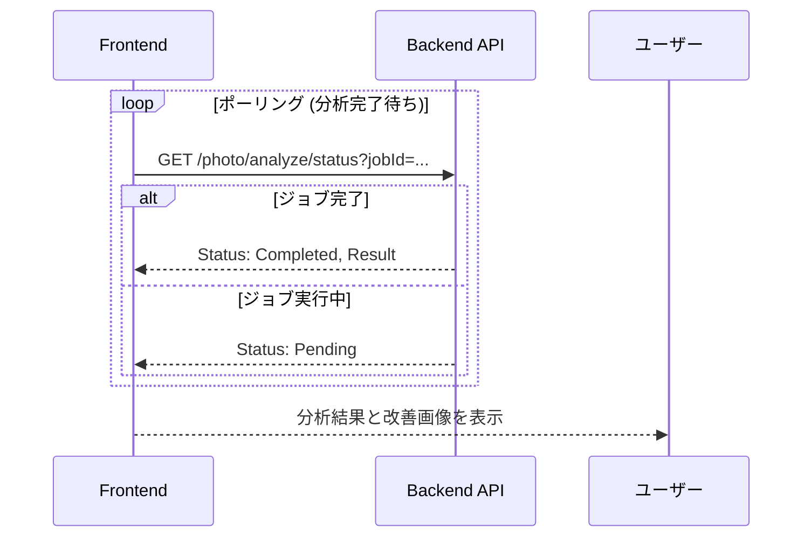
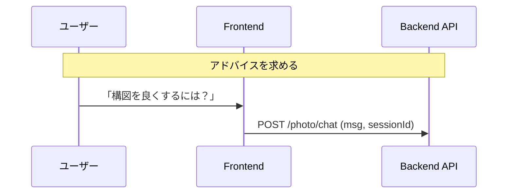
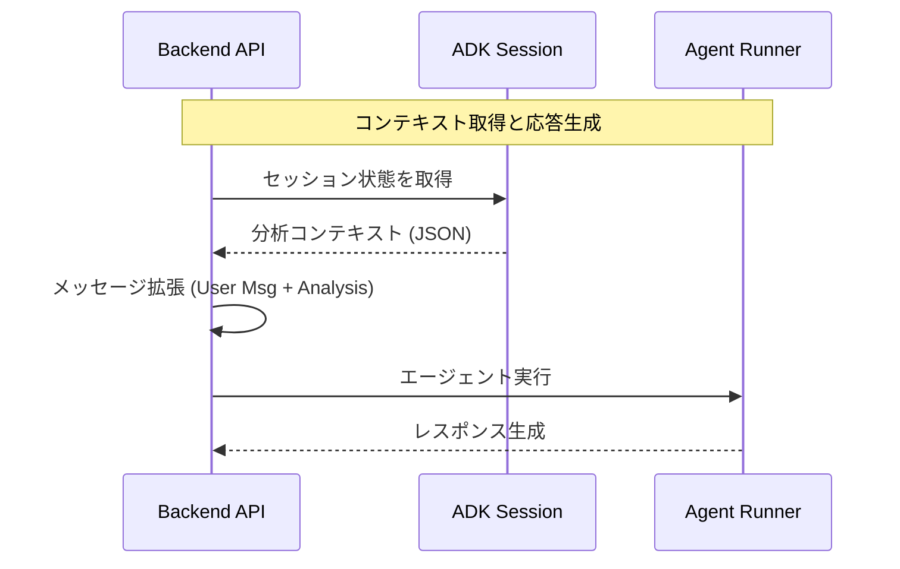

# Photo Levelup 処理フロー

このドキュメントでは、Photo Levelup アプリケーションにおける画像分析とチャットインタラクションの処理フローを説明します。
スマートフォンでの視認性を高めるため、処理フローを分割して記載しています。

## 1. 画像アップロードと分析ジョブ開始

ユーザーが写真をアップロードし、バックエンドが非同期ジョブを受け付けるまでのフローです。



## 2. バックグラウンド処理: 分析と改善

非同期ワーカーが画像をGeminiで分析・改善し、Cloud Storageに保存するフローです。



### AIモデル連携詳細

入力画像から採点・講評を経て、添削・お手本画像を作成する詳細フローです。

```mermaid
graph TD
    Input[入力画像] --> Flash[Gemini 3 Flash Preview]
    Flash -->|採点と講評| Grading[採点・講評]
    Grading --> Pro[Gemini 3 Pro Image Preview<br/>(Nanobanana pro)]
    Pro --> Corrected[添削画像]
    Pro --> Example[お手本画像]
```

## 3. バックグラウンド処理: セッション状態の保存

分析結果をADKセッション（Firestore）に保存し、会話の基点となるイベントを記録します。



## 4. ポーリングと結果表示

フロントエンドがジョブの完了を検知し、結果を表示するフローです。



## 5. チャットインタラクション: 質問送信

ユーザーが分析結果について質問する場合のフローです。



## 6. チャットインタラクション: エージェント実行

バックエンドがADKセッションから分析結果を取得し、エージェントを実行して回答を生成するフローです。


