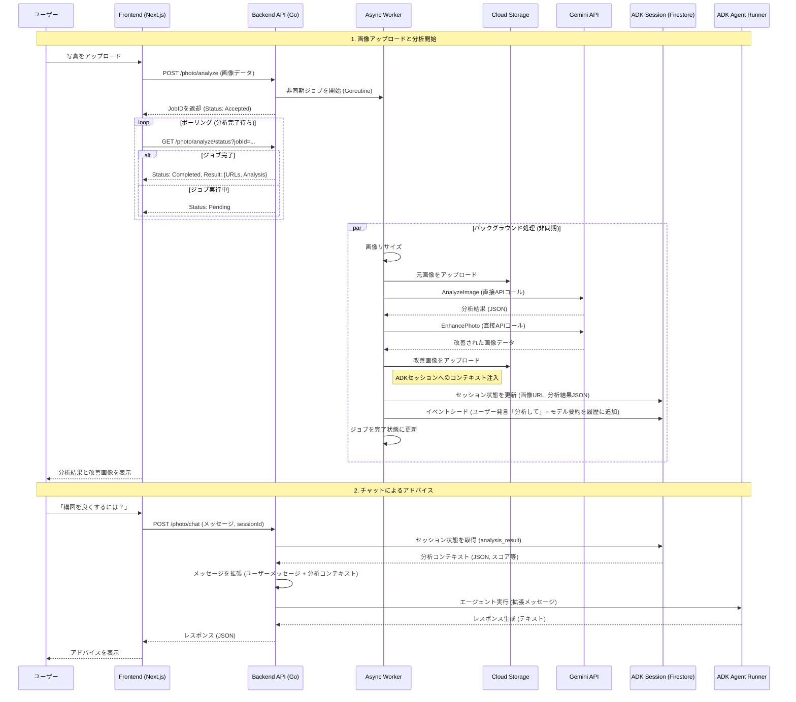

# Photo Levelup 処理フロー

このドキュメントでは、Photo Levelup アプリケーションにおける画像分析とチャットインタラクションの処理フローを説明します。

## シーケンス図

```mermaid
sequenceDiagram
    participant User as ユーザー
    participant FE as Frontend (Next.js)
    participant API as Backend API (Go)
    participant Worker as Async Worker
    participant GCS as Cloud Storage
    participant Gemini as Gemini API
    participant ADK as ADK Session (Firestore)
    participant Agent as ADK Agent Runner

    Note over User, Agent: 1. 画像アップロードと分析開始
    User->>FE: 写真をアップロード
    FE->>API: POST /photo/analyze (画像データ)
    API->>Worker: 非同期ジョブを開始 (Goroutine)
    API-->>FE: JobIDを返却 (Status: Accepted)

    loop ポーリング (分析完了待ち)
        FE->>API: GET /photo/analyze/status?jobId=...
        alt ジョブ完了
            API-->>FE: Status: Completed, Result: {URLs, Analysis}
        else ジョブ実行中
            API-->>FE: Status: Pending
        end
    end

    par バックグラウンド処理 (非同期)
        Worker->>Worker: 画像リサイズ
        Worker->>GCS: 元画像をアップロード

        Worker->>Gemini: AnalyzeImage (直接APIコール)
        Gemini-->>Worker: 分析結果 (JSON)

        Worker->>Gemini: EnhancePhoto (直接APIコール)
        Gemini-->>Worker: 改善された画像データ
        Worker->>GCS: 改善画像をアップロード

        Note right of Worker: ADKセッションへのコンテキスト注入
        Worker->>ADK: セッション状態を更新 (画像URL, 分析結果JSON)
        Worker->>ADK: イベントシード (ユーザー発言「分析して」+ モデル要約を履歴に追加)
        Worker->>Worker: ジョブを完了状態に更新
    end

    FE-->>User: 分析結果と改善画像を表示

    Note over User, Agent: 2. チャットによるアドバイス
    User->>FE: 「構図を良くするには？」
    FE->>API: POST /photo/chat (メッセージ, sessionId)

    API->>ADK: セッション状態を取得 (analysis_result)
    ADK-->>API: 分析コンテキスト (JSON, スコア等)

    API->>API: メッセージを拡張 (ユーザーメッセージ + 分析コンテキスト)

    API->>Agent: エージェント実行 (拡張メッセージ)
    Agent-->>API: レスポンス生成 (テキスト)
    API-->>FE: レスポンス (JSON)
    FE-->>User: アドバイスを表示
```
