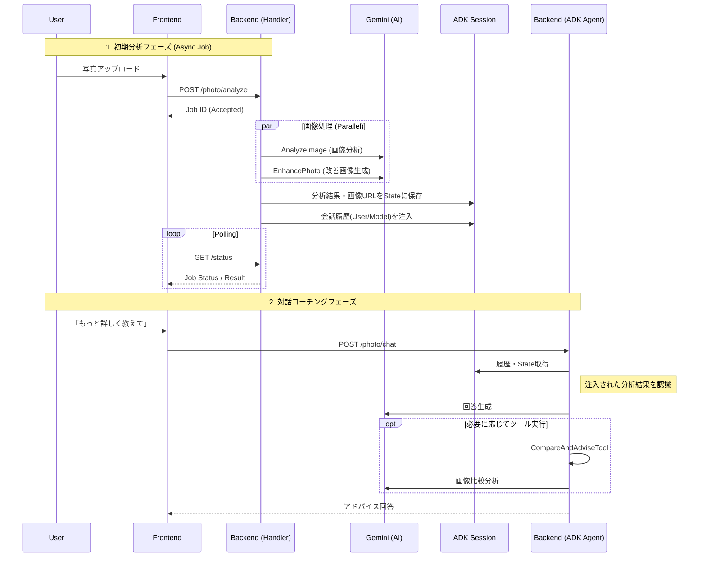

# Photo Levelup (Photo Coach) 技術解説

このプロジェクトは、AIを活用して写真のスキル向上をサポートする「Photo Levelup (Photo Coach)」の実装解説です。
Google Cloud の Vertex AI (Gemini) と、Go言語によるエージェント開発キット (ADK: Agent Development Kit) を組み合わせた、実践的なAIエージェントシステムの事例として紹介します。

## 1. システムアーキテクチャ

本システムは、以下の技術スタックで構成されています。

- **Frontend**: Next.js (Firebase App Hosting)
- **Backend**: Go (Cloud Run)
  - **Framework**: Standard `net/http` + Google ADK (Agent Development Kit)
- **AI Model**: Google Gemini (Pro / Flash / Image Preview)
- **Database**: Firestore (Session Management)
- **Storage**: Cloud Storage (Image Storage)

## 2. 処理の流れ（ハイブリッド・アーキテクチャ）

このプロジェクトの最大の特徴は、**「重い画像処理を行うバックエンドハンドラ」**と**「対話を行うADKエージェント」**を組み合わせたハイブリッドな構成にあります。

通常、すべての処理をエージェント（LLM）に任せると、画像分析や生成といった時間のかかる処理中にタイムアウトしたり、コンテキストが複雑になりすぎたりする課題があります。
そこで本システムでは、画像のアップロードから分析・生成までをGo言語のハンドラで高速・並列に処理し、その結果をADKのセッション状態（State）に「注入」することで、スムーズな対話を実現しています。

### フロー図 (Mermaid)

## 3. 実装の工夫点・ハッカソンアピールポイント

### 🚀 ハイブリッドなAI処理パイプライン
エージェント単体ですべてを行わず、適材適所で処理を分担しています。
- **画像分析・生成**: Go言語の並列処理（Goroutines）を活用し、分析と画像生成（通常版・クリーン版）を同時に実行することで、ユーザーの待ち時間を短縮しています。
- **対話・コーチング**: 状態管理が得意なADKを活用し、文脈を踏まえた深いアドバイスを提供します。

### 💉 ADKセッションへのコンテキスト注入 (`seedAnalysisEvents`)
通常、エージェントは「ユーザーとの会話」しか知りません。しかし、本システムではバックエンドで行った画像分析の結果を、まるで「直前に会話したかのように」セッション履歴に人工的に注入（Seed）しています。
これにより、ユーザーがチャットを開始した時点で、AIは既にその写真のことを深く理解しており、自然な流れでコーチングを開始できます。

### 🎨 マルチモーダルな機能活用
Gemini のマルチモーダル機能をフル活用しています。
- **Vision (入力)**: 写真の構図・露出・色彩・ライティングなどを8項目で数値化して分析。
- **Image Generation (出力)**: 単なるテキストアドバイスだけでなく、Gemini 3 Pro Image Preview モデルを使用して「理想的な改善例（お手本）」を実際に生成して提示します。
- **Comparison (比較)**: 元画像と生成された改善例を再度Geminiに入力し、どこがどう変わったかを具体的に解説させます。

### 📝 具体的な「赤ペン先生」機能
画像生成プロンプトの工夫により、単に綺麗な写真を生成するだけでなく、改善ポイントに「赤ペン」で書き込みを入れたような画像を生成させ、視覚的にわかりやすいフィードバックを実現しています。

---

このアーキテクチャにより、Webアプリとしての応答速度（UX）と、AIエージェントとしての賢さ（Context）を両立させています。
